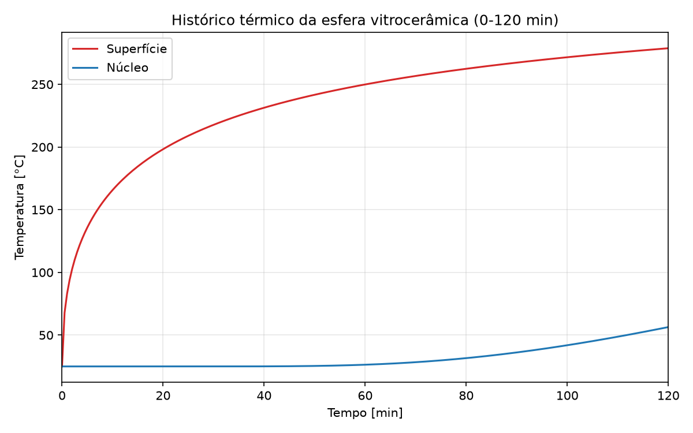

# Transcal — Câmara Secadora + Esfera Vitrocerâmica

Simulação numérica de um problema acoplado de transferência de calor:

1. Uma **câmara secadora** retangular (8 × 4 × 3 m), em **regime permanente**, com piso aquecido eletricamente a 350 °C, radiação interna entre 6 superfícies cinzas-difusas-opacas, convecção natural interna, perda global para o ambiente externo e infiltração de ar.
2. Uma **esfera vitrocerâmica** (Ø 0,5 m) que atravessa essa câmara em 120 min, em **regime transitório**, trocando calor por convecção natural + radiação com o interior da câmara já resolvido no item 1.

Este README resume a metodologia, discute os resultados obtidos e explica como rodar o projeto.

---

## Metodologia teórica

### 1. Fatores de forma radiativos (F<sub>i→j</sub>)

A câmara é um paralelepípedo de 6 superfícies planas (`S1`=piso, `S2`=teto, `S3`–`S6`=paredes laterais). Os fatores de forma entre pares de superfícies são calculados **analiticamente** (não por integração numérica), usando as relações clássicas de Hamilton & Morgan (1952):

- **Caso A — retângulos paralelos opostos** (piso↔teto, paredes opostas);
- **Caso B — retângulos perpendiculares com aresta comum** (piso/teto↔paredes).

Por simetria especular do paralelepípedo, apenas 6 das 15 combinações de pares precisam ser avaliadas; o restante da matriz 6×6 é obtido por reciprocidade (A<sub>i</sub>F<sub>i→j</sub> = A<sub>j</sub>F<sub>j→i</sub>) e pela equivalência geométrica piso↔teto frente às paredes.

### 2. Radiosidade (troca radiativa entre superfícies cinzas-difusas)

Com emissividade uniforme ε = 0,9, a radiosidade **J** de cada superfície satisfaz o sistema linear 6×6:

```
[I − (I−ε)F] J = ε σ T⁴      (resolvido por solver direto, numpy.linalg.solve)
```

A matriz `[I−(I−ε)F]` é diagonal-dominante (Gershgorin) e portanto sempre bem-condicionada. Esse "solve" é refeito a cada avaliação de **T** dentro do laço não-linear externo. O fluxo radiativo líquido por superfície é q<sub>i</sub> = ε<sub>i</sub>A<sub>i</sub>/(1−ε<sub>i</sub>) · (σT<sub>i</sub>⁴ − J<sub>i</sub>), com Σq<sub>i</sub> = 0 (conservação de energia radiativa num invólucro fechado).

### 3. Convecção natural interna

Para cada superfície, o número de Rayleigh é avaliado na temperatura de filme entre a superfície e o ar interno (nó único T<sub>int</sub>), com propriedades do ar interpoladas de tabela (Incropera Tab. A.4):

- **Piso (S1)**: placa horizontal aquecida por baixo — McAdams (Nu = 0,54·Ra<sup>1/4</sup> ou 0,15·Ra<sup>1/3</sup>);
- **Teto (S2)**: mesma família de correlações, mas o ramo (placa quente/fria) depende do sinal de (T<sub>2</sub>−T<sub>int</sub>), que só é conhecido após a solução (reavaliado a cada iteração do solver);
- **Paredes laterais (S3–S6)**: placa vertical — Churchill–Chu (1975), válida para todo Ra.

### 4. Balanço de energia em regime permanente (sistema não-linear)

As 5 superfícies passivas (S2–S6) e o nó de ar interno formam um sistema de 6 equações não-lineares em **u** = [T₂,…,T₆, T<sub>int</sub>] (T₁ = 350 °C é fixo):

- Para cada superfície passiva: ganho convectivo do ar = perda radiativa líquida + perda para o ambiente externo via U;
- Para o nó de ar: soma das trocas convectivas com as 6 superfícies = entalpia carregada pela infiltração de ar externo (3 m³/min).

O sistema R(**u**) = 0 é resolvido com `scipy.optimize.root` (método `'lm'` — Levenberg-Marquardt), a partir de um palpite inicial que quebra a simetria entre as superfícies passivas usando os próprios fatores de forma F<sub>1→i</sub> (evita o ponto degenerado T<sub>i</sub>=T<sub>int</sub>, onde o Jacobiano numérico do teto é mal-condicionado). Cada componente do resíduo é normalizada pela maior perda possível daquele nó, para que a tolerância do solver seja comparável entre os 6 graus de liberdade.

A potência da resistência elétrica do piso é obtida fechando o balanço de S1: convecção para o ar + radiação líquida + perda para o ambiente.

### 5. Regime transitório da esfera vitrocerâmica

A esfera entra a 25 °C e atravessa a câmara em 120 min, recebendo calor por:

- **Convecção natural** — correlação de Churchill (1975) para esferas, Nu<sub>D</sub> = 2 + 0,589·Ra<sub>D</sub><sup>1/4</sup>/[1+(0,469/Pr)<sup>9/16</sup>]<sup>4/9</sup>;
- **Radiação** — linearizada (h<sub>rad</sub>), trocando com uma temperatura de vizinhança efetiva T<sub>surr</sub> (média de 4ª potência das 6 superfícies, ponderada por ε<sub>k</sub>A<sub>k</sub>).

O número de Biot decide o modelo térmico: Bi < 0,1 → capacitância concentrada; Bi ≥ 0,1 → gradiente interno relevante. Como o resultado cai no segundo caso (ver [Resultados](#resultados)), a condução transiente é resolvida pela **solução analítica em série de autovalores** para esfera com condição de contorno convectiva (raízes de ζ·cot ζ = 1−Bi, Incropera Tab. 5.1), entregando separadamente a temperatura do núcleo (r*=0) e da superfície (r*=1) ao longo do tempo. Como o coeficiente combinado h<sub>total</sub> depende da própria temperatura de superfície (que é a incógnita), o problema é resolvido por **iteração de ponto fixo**: itera-se uma temperatura de superfície representativa até autoconsistência com a média da curva resultante (resultado satisfatório após 5 iterações).

A velocidade de deslocamento da esfera (≈1,1 mm/s) é usada apenas para verificar, via Gr<sub>D</sub>/Re<sub>D</sub>², que a convecção forçada pelo movimento é desprezível frente à natural (premissa confirmada numericamente em Resultados).

---

## Resultados

Execução de referência (`python main.py`), câmara 8×4×3 m, T₁ = 350 °C, T<sub>∞</sub> = 25 °C, ε = 0,9, U = 1 W/m².°C, infiltração = 3 m³/min:

**1) Fatores de forma F<sub>i→j</sub>** (soma de cada linha = 1,000, reciprocidade e simetria F<sub>21</sub>=F<sub>12</sub> verificadas):

|      | S1    | S2    | S3    | S4    | S5    | S6    |
|------|-------|-------|-------|-------|-------|-------|
| S1   | 0,000 | 0,377 | 0,101 | 0,101 | 0,211 | 0,211 |
| S2   | 0,377 | 0,000 | 0,101 | 0,101 | 0,211 | 0,211 |
| S3   | 0,268 | 0,268 | 0,000 | 0,053 | 0,205 | 0,205 |
| S4   | 0,268 | 0,268 | 0,053 | 0,000 | 0,205 | 0,205 |
| S5   | 0,281 | 0,281 | 0,103 | 0,103 | 0,000 | 0,232 |
| S6   | 0,281 | 0,281 | 0,103 | 0,103 | 0,232 | 0,000 |

**2–6) Balanço da câmara:**

| Superfície | T [°C] | h<sub>c</sub> [W/m².K] | J [W/m²] |
|---|---|---|---|
| S1 (piso, ativa) | 350,00 | 4,368 | 8415,59 |
| S2 (teto) | 324,87 | 1,273 | 7289,73 |
| S3 (x=0) | 321,85 | 2,825 | 7148,90 |
| S4 (x=W) | 321,85 | 2,825 | 7148,90 |
| S5 (y=0) | 322,15 | 2,833 | 7163,59 |
| S6 (y=L) | 322,15 | 2,833 | 7163,59 |

T<sub>int</sub> = T<sub>ar,sai</sub> = **291,22 °C** — Potência da resistência **Q<sub>resist</sub> = 57.253,7 W (≈57,25 kW)**.

**7) Perfil transitório da esfera** (série completa de 241 pontos no stdout de `python main.py`; amostras abaixo):

| t [min] | T<sub>superfície</sub> [°C] | T<sub>núcleo</sub> [°C] |
|---|---|---|
| 0 | 25,00 | 25,00 |
| 30 | 217,73 | 25,00 |
| 60 | 249,93 | 26,37 |
| 90 | 267,35 | 36,16 |
| 120 | 278,81 | 56,38 |



### Discussão

- **As paredes passivas (≈322–325 °C) ficam mais quentes que o ar interno (291 °C).** Isso é fisicamente consistente: o piso a 350 °C irradia intensamente (ε=0,9, grandes fatores de forma) para teto e paredes, que recebem mais energia por radiação do que perdem por convecção para o ar — o excedente é escoado por convecção para o ar (mais frio) e, lentamente, para o ambiente externo via U=1 W/m².°C. O acoplamento radiativo, não a convecção, domina a temperatura das superfícies passivas.
- **Verificações de consistência fecham dentro da tolerância numérica do solver:** Σq<sub>i</sub> ≈ −5×10⁻¹⁰ W (conservação radiativa) e Q<sub>resist</sub> = ΣU<sub>i</sub>A<sub>i</sub>ΔT + ṁ<sub>inf</sub>c<sub>p</sub>ΔT com erro ≈ 10⁻¹⁰ W — toda a potência elétrica injetada é, no agregado, dissipada pelo envoltório (perdas U) e pela infiltração de ar. `scipy.optimize.root(method='lm')` converge em 38 avaliações de resíduo.
- **A esfera exige modelo distribuído, não capacitância concentrada:** Bi<sub>lumped</sub> = h<sub>total</sub>·(D/6)/k ≈ **2,53 ≫ 0,1**. O coeficiente combinado (h<sub>total</sub>≈42,5 W/m².K) é dominado pela radiação (h<sub>rad</sub>≈39,2 vs. h<sub>conv</sub>≈3,3 W/m².K), já que a esfera "vê" superfícies a ~320–330 °C. Isso, somado à baixa difusividade térmica do vitrocerâmico (α=k/(ρc<sub>p</sub>)≈7,0×10⁻⁷ m²/s), produz um número de Fourier total pequeno (Fo≈0,08 em 120 min) — coerente com a defasagem observada no gráfico: a superfície aquece rapidamente (curva logarítmica) enquanto o núcleo permanece praticamente em 25 °C até ~t=40 min e só alcança 56,4 °C ao final dos 120 min.
- **Convecção forçada pelo deslocamento da esfera é desprezável**, confirmando a Premissa A5: Gr<sub>D</sub>/Re<sub>D</sub>² ≈ 4,15×10⁵ ≫ 1.
- Um aviso de log (`Correlação de Churchill fora do domínio de validade`) aparece porque o Pr do ar na temperatura de filme cai ligeiramente abaixo de 0,7 (≈0,694–0,696) — desvio pequeno, sem efeito relevante sobre Nu<sub>D</sub>, mas registrado para rastreabilidade.

---

## Estrutura do código e dos módulos

```
projeto-transcal/
├── main.py                              # Orquestrador: roda os 3 módulos físicos e consolida itens 1-7
├── pyproject.toml                       # Empacotamento (setuptools, src layout)
├── requirements.txt                     # Dependências para instalação rápida via pip
├── figures/
│   └── sphere_temperature_history.png   # Gráfico gerado pelo módulo transient
└── src/transcal/
    ├── radiation/
    │   └── view_factors.py              # Fatores de forma F_i->j + validação (item 1)
    ├── balance/
    │   └── solver.py                    # Propriedades do ar, convecção, radiosidade,
    │                                     # sistema não-linear R(u)=0 e scipy.optimize.root (itens 2-6)
    └── transient/
        └── transient.py                 # Biot, Churchill (esfera), série de autovalores e plot (item 7)
```

| Módulo | Responsabilidade
|---|---|
| `radiation/view_factors.py` | Geometria das 6 superfícies, F<sub>i→j</sub> (Casos A/B), reciprocidade, validação |
| `balance/solver.py` | Propriedades do ar, h<sub>c</sub> das 6 faces, radiosidade **J**, sistema não-linear R(**u**)=0, T₂–T₆/T<sub>int</sub>/T<sub>ar,sai</sub>/Q<sub>resist</sub> |
| `transient/transient.py` | Cinemática/Biot da esfera, h<sub>conv</sub>+h<sub>rad</sub>, série de autovalores (núcleo×superfície), plot |
| `main.py` | Chama os 3 módulos em sequência e monta o dicionário consolidado dos itens 1–7 (`compilar_resultados`) |

Cada módulo também é executável isoladamente (bloco `if __name__ == "__main__":`) e imprime seus próprios resultados e verificações — útil para depurar uma etapa sem rodar o pipeline inteiro (ver [Como instalar e executar](#como-instalar-e-executar)).

---

## Como instalar e executar

### Pré-requisitos

- Python ≥ 3.10 (testado com 3.12)
- `pip`

### Passo a passo

```bash
# 1. Entre no diretório do projeto (ou clone o repositório, se ainda não o tiver feito)
cd projeto-transcal

# 2. Crie e ative um ambiente virtual
python3 -m venv venv
source venv/bin/activate        # Windows: venv\Scripts\activate

# 3. Instale as dependências
pip install -r requirements.txt
# (alternativa: instala o pacote `transcal` em modo editável, usando pyproject.toml)
# pip install -e .

# 4. Rode o pipeline completo
python main.py
```

A execução imprime no terminal os 7 itens do projeto (fatores de forma, coeficientes convectivos, temperaturas, radiosidades, potência da resistência e perfil da esfera) e salva o gráfico do histórico térmico em `figures/sphere_temperature_history.png`.

### Rodando módulos individualmente

Cada módulo de física roda de forma independente e imprime suas próprias checagens de consistência (§10 da SPEC):

```bash
python -m transcal.radiation.view_factors   # matriz F_ij + validação (soma=1, reciprocidade, simetria)
python -m transcal.balance.solver           # balanço da câmara + validação (conservação radiativa, fechamento global)
python -m transcal.transient.transient      # regime transitório da esfera + critérios de validade (Biot, Gr/Re², domínio de Churchill)
```

---

## Saídas geradas

| Arquivo | Conteúdo |
|---|---|
| `figures/sphere_temperature_history.png` | Gráfico T<sub>núcleo</sub>(t) e T<sub>superfície</sub>(t), 0–120 min |
| stdout de `python main.py` | Os 7 itens consolidados em DataFrames/Series do pandas |
